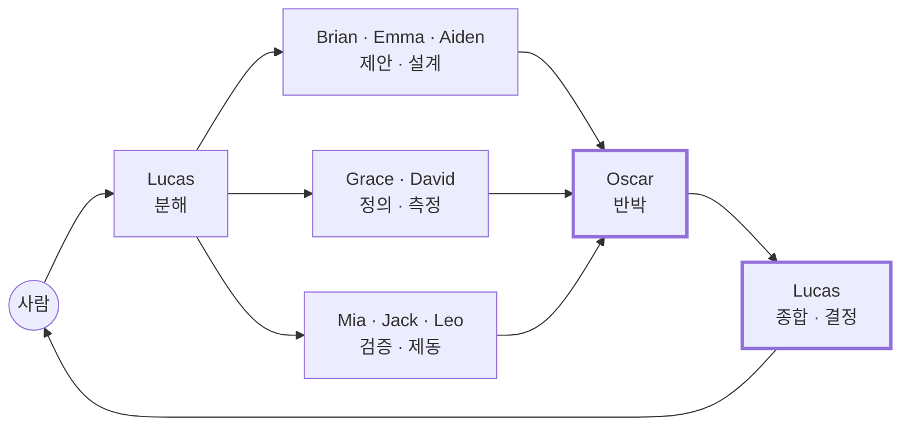
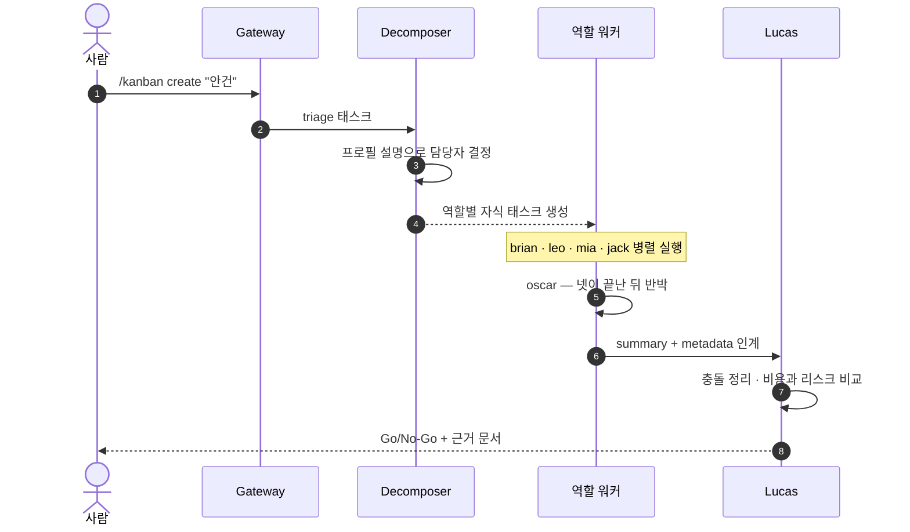
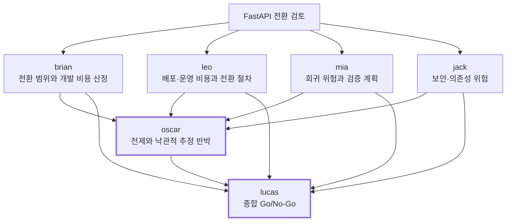
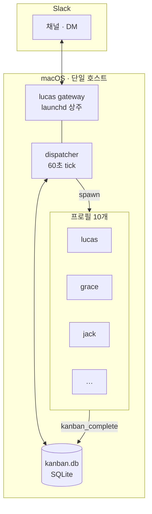

# BA Team

**서로 견제하는 열 명의 AI가 하나의 결정을 만든다.**

역할(Role)과 성향(Disposition)을 분리해 구성한 10인 가상 개발팀을 [Hermes Agent](https://hermes-agent.nousresearch.com/docs/) 위에 프로필 10개로 세우고, Kanban 보드로 협업시키며 Slack에서 대화한다.

한 모델에게 "여러 관점에서 검토해줘"라고 부탁하는 것과는 다르다. **열 개의 독립된 프로세스**가 각자의 시스템 프롬프트와 모델을 가지고, 각자의 판단 기준으로 결론을 내고, 서로의 결론을 읽고 반박한다.

<table>
<tr>
<td width="50%" valign="top">

**한 명에게 물으면**

> FastAPI 전환은 성능 이점이 있고 점진적 마이그레이션이 안전합니다. Strangler 패턴을 권장합니다.

</td>
<td width="50%" valign="top">

**열 명에게 물으면**

> 네 검토가 모두 실제 코드/트래픽을 확인하지 못한 채 점진 공존으로 수렴한 것은 **관성에 가깝다.** — Oscar
>
> 전환 자체는 **No-Go**. 인벤토리·기준선과 비교 PoC만 Go. — Lucas

</td>
</tr>
</table>

이 저장소는 **페르소나 정의와 구축 문서**를 담는다. 실행 코드는 없다 — Hermes Agent가 런타임을 전부 제공한다.

---

## 구성

| 프로필 | 역할 | 성향 | 무엇을 의심하는가 |
| --- | --- | --- | --- |
| `lucas` | Tech Lead | 균형형 · 조율자 | 6개월 뒤에도 유지보수 가능한가 |
| `grace` | Business Analyst | 보수적 · 정책 중심 | 예외 상황이 정의되어 있는가 |
| `brian` | Backend | 진보적 · 기술 혁신 | 성능 한계가 측정 가능하게 드러났는가 |
| `emma` | Frontend / UX | 창의적 · 경험 중심 | 사용자가 이 화면에서 헤매지 않는가 |
| `mia` | QA | 보수적 · 검증 중심 | 재현 가능한가 |
| `leo` | DevOps / SRE | 현실주의 · 자동화 | 장애를 사용자보다 먼저 아는가 |
| `david` | Data | 객관적 · 데이터 중심 | 성공을 측정할 지표가 있는가 |
| `aiden` | AI | 실험적 · 미래 지향 | AI 없이 더 단순하게 풀 수 있지 않은가 |
| `jack` | Security | 매우 보수적 · 위험 회피 | 최소 권한 원칙이 지켜지는가 |
| `oscar` | Devil's Advocate | 회의적 · 반증 중심 | 이 결정이 틀렸다면 무엇을 보고 아는가 |

### 성향 스펙트럼

```
    진보 ◄───────────────────────────────────────────────────► 보수

    aiden   brian   emma   leo   david   lucas   mia   grace   jack
                                           ▲
                                     최종 결정자

                          oscar  ─  축 밖에서 모든 결정에 반증
```

의도적으로 대립하도록 배치했다. Brian이 최신 기술을 밀면 Jack이 권한을 묻고, Mia가 증거를 요구하고, Leo가 롤백 절차를 확인하고, Grace가 업무 영향을 따진다. **합의가 너무 쉽게 이뤄지는 것이 이 팀의 실패 방식이다.**

---

## 회의는 이렇게 진행된다



Oscar는 **다른 역할의 결론이 모두 나온 뒤에** 실행된다. 그래야 합의 자체를 공격할 수 있다. Lucas는 Oscar까지 끝난 뒤 종합한다.

### 런타임



각 워커는 독립된 OS 프로세스로 뜬다. 자기 모델, 자기 시스템 프롬프트, 자기 메모리를 가진다.

---

## 실제 실행 기록

`"Flask 기반 API를 FastAPI로 전환하는 안. 비용과 리스크를 판단해달라."` 한 줄을 던진 결과다.



네 역할은 서로 다른 각도에서 검토했고, 넷 다 "점진적 전환"으로 수렴했다. 그때 Oscar가 개입했다.

> **네 검토가 모두 실제 코드/트래픽을 확인하지 못한 채 점진 공존으로 수렴한 것은 관성에 가깝다.**
>
> FastAPI 성능 우위가 입증되지 않았고, 비용 추정은 문서 간 불일치(10\~20인주 대 2\~5인월)와 이중 운영·제거 비용 누락이 있다. 라우팅 rollback으로 되돌릴 수 없는 DB/이벤트/외부 부작용을 과소평가했다.

Lucas는 이를 반영해 결론을 갈랐다.

| 안 | 판정 |
| --- | --- |
| Flask 유지 · 최적화 | **Go** |
| 인벤토리 · 기준선 측정 (3\~5영업일) | **Go** |
| 비교 PoC (2\~3주) | **Go** |
| 제한적 FastAPI 카나리 | 게이트 통과 후 **별도 승인** |
| 점진적 전체 전환 | **No-Go** |
| 전면 재작성 | **No-Go** |

**Oscar가 없었다면 "점진 전환 Go"로 끝났을 안건이다.** 반증 역할을 정식 멤버로 넣은 이유가 여기서 확인된다.

전 과정은 [`docs/02-kanban-workflow.md`](./docs/02-kanban-workflow.md) 에 기록되어 있다.

---

## 시스템 구성



**Hermes에서 프로필 하나가 에이전트 하나다.** `SOUL.md` 하나, 모델 하나. 그래서 역할 10개는 프로필 10개가 된다. 한 프로필 안에 여러 페르소나를 두는 구조는 존재하지 않는다.

| 계층 | 실체 |
| --- | --- |
| 페르소나 | `roles/*.md` → 각 프로필의 `SOUL.md` (시스템 프롬프트 슬롯 #1) |
| 모델 | 프로필별 `config.yaml` — 역할 성향에 맞춰 배정 |
| 배정 | 프로필 `description` — decomposer가 이걸 읽고 담당자를 고른다 |
| 협업 | Kanban 보드 — 태스크의 `assignee` 가 프로필명 |
| 상주 | `lucas` 게이트웨이만. 나머지는 배정될 때 기동되고 끝나면 종료 |

---

## 저장소 구조

```
roles/                     페르소나 정의 10개 — 각 프로필 SOUL.md 의 원본
  ├ lucas-tech-lead.md
  ├ grace-business-analyst.md
  ├ …
  ├ _team.md               전원 공통 — 동료 목록과 Kanban 사용 규약
  └ _orchestrator.md       lucas 전용 — 분해 기준과 종합 방식

config/
  ├ models.conf            역할별 모델 배정
  └ descriptions.conf      역할별 설명 — decomposer 라우팅의 근거

scripts/
  ├ install-souls.sh       roles/*.md → 각 프로필 SOUL.md
  ├ set-models.sh          models.conf 적용
  ├ set-descriptions.sh    descriptions.conf 적용
  ├ install-skills.sh      skills/ → 각 프로필 skills/
  └ ask-team.sh            여러 역할에 병렬 질의 · 취합 · 종합

skills/
  ├ meeting-note/          회의 종료 시 Notion 회의록 작성
  └ daily-log/             매일 새벽 Notion 일일 요약

docs/                      번호 순서대로 진행한다
  ├ 01-setup.md            프로필 10개 생성 · SOUL.md · 모델          [필수]
  ├ 02-kanban-workflow.md  보드 · 프로필 설명 · 디스패처 · 태스크 흐름  [필수]
  ├ 03-gateway-slack.md    Slack 연동 전략 (앱을 몇 개 둘 것인가)      [Slack]
  ├ 04-slack-setup.md      Slack 앱 발급 · 권한 · 토큰                [Slack]
  ├ 05-slack-usage.md      Slack에서 쓰는 법                         [Slack]
  ├ 06-team-workflow.md    보조 — 터미널에서 여러 역할에 직접 질의     [선택]
  ├ 07-notion.md           Notion 연동 — 회의록 · 일일 요약           [선택]
  └ archive/               폐기된 초기 설계
```

---

## 시작하기

전제: macOS · [Hermes Agent](https://hermes-agent.nousresearch.com/docs/getting-started/installation) 설치 · 템플릿 프로필 하나 설정 완료.

```bash
git clone git@github-al8bright:al8bright/hermes-slack.git ~/dev/hermes-slack
cd ~/dev/hermes-slack
```

```bash
# 역할 프로필 10개 생성
for id in lucas grace brian emma mia leo david aiden jack oscar; do
  hermes profile create "$id" --clone-from bateam
done

# 페르소나 · 모델 · 설명 주입
./scripts/install-souls.sh
./scripts/set-models.sh
./scripts/set-descriptions.sh

# 동작 확인
lucas chat -q "너는 누구고 팀에서 무슨 일을 하지?"
mia   chat -q "이 기능 배포해도 될까?"
```

Mia가 재현 결과부터 되물으면 성공이다. 이어서 [`docs/01-setup.md`](./docs/01-setup.md) 를 따른다.

### 쓰기

```bash
# 터미널 — 안건 하나로 회의 열기
hermes kanban create "결제에 외부 PG를 추가하려 한다" \
  --body "해외 결제 요구 증가. 기존 정산 로직과의 호환이 관건." --triage
hermes kanban decompose <task-id>
hermes kanban list
```

```
# Slack
@BA Team FastAPI가 Flask보다 항상 빠른가요?          대화 (Lucas 응답)
/kanban create "결제에 외부 PG를 추가하려 한다"        회의 (자동 분해 → 종합)
/kanban create "권한 모델 검토해줘" --assignee jack    특정 역할만
/kanban list                                         현황
```

칸반을 열 정도가 아니면 터미널에서 바로 묻는다.

```bash
./scripts/ask-team.sh --roles jack,mia,oscar --synthesize \
  "사내 문서 검색에 외부 LLM API를 쓰려 한다"
```

---

## 설계 원칙

**역할과 성향을 분리한다.** 같은 QA라도 성향이 다르면 다른 결론이 나온다. 두 축을 나눠 배치해야 관점이 겹치지 않는다.

**반대 의견을 정식 멤버로 만든다.** 리뷰어에게 "비판적으로 봐주세요"라고 부탁하는 것과, 반박만을 임무로 하는 참여자를 두는 것은 다르다. Oscar는 결정을 막을 권한이 없다. 근거를 단단하게 만드는 역할이다.

**결정권은 한 명에게 둔다.** 열 명이 동등하게 투표하면 결론이 나오지 않는다. Lucas가 종합하고 판단한다. 나머지는 의견을 분명히 내되 결정을 대신하지 않는다.

**틀렸을 때의 신호를 함께 적는다.** 결정에 "이게 틀렸다면 무엇을 보고 알 수 있는가"가 없으면 결정이 아니라 선언이다.

**모든 인계가 기록으로 남는다.** 누가 언제 무엇을 근거로 판단했는지가 SQLite에 남는다. 컨텍스트가 압축돼도 사라지지 않는다.

---

## 제약

- **단일 호스트 전용** — Kanban DB와 워커 PID가 로컬이다. 맥 한 대에서만 돈다.
- **대화는 Lucas에게만** — Slack 앱이 하나이므로 `@Grace` 로 직접 부를 수 없다. 역할 지목은 `--assignee` 로 한다.
- **역할이 스스로 다른 역할을 부르는 것은 태스크 단위로만** — 대화 중 즉석 호출은 되지 않는다.
- **scratch 작업공간은 완료 시 삭제** — 산출물은 첨부로 남기거나 `--workspace dir:` 를 준다.

---

<div align="center">

**[구축 절차](./docs/01-setup.md)** · **[협업 방식](./docs/02-kanban-workflow.md)** · **[Slack 연동](./docs/04-slack-setup.md)** · **[사용법](./docs/05-slack-usage.md)**

</div>
