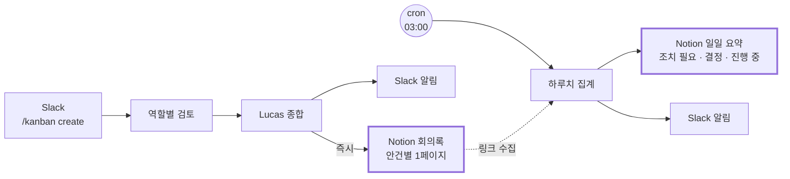

# Notion 연동 — 회의록과 일일 요약

> 상위 문서: [README.md](./README.md) · 선행: [02-kanban-workflow.md](./02-kanban-workflow.md)

Slack에서 연 회의가 Notion에 자동으로 기록되게 한다. **회의록은 회의가 끝나는 순간, 일일 요약은 매일 새벽에** 쓰인다.

---

## 1. 두 층으로 나눈다



| | 회의록 | 일일 요약 |
| --- | --- | --- |
| 시점 | 종합 완료 즉시 | 매일 03:00 |
| 단위 | 안건 하나 | 하루 전체 |
| 쓰는 주체 | Lucas (종합 태스크 안에서) | cron 작업 |
| 스킬 | [`meeting-note`](../skills/meeting-note/SKILL.md) | [`daily-log`](../skills/daily-log/SKILL.md) |
| 답하는 질문 | "왜 그렇게 결정했나" | "오늘 뭘 해야 하나" |

**회의록을 새벽에 몰아 쓰지 않는 이유** — 종합 태스크에는 각 역할의 `summary` 와 `metadata` 가 이미 손에 들려 있다. 그 자리에서 쓰는 게 가장 정확하다. 몇 시간 뒤 DB를 뒤져 재구성하면 뉘앙스가 날아간다.

**일일 요약이 따로 필요한 이유** — 회의록은 끝난 것만 남긴다. **차단되어 멈춘 것, 하루 넘게 도는 것은 아무도 알려주지 않는다.** 그걸 드러내는 게 일일 요약의 존재 이유다.

---

## 2. Notion 준비

### 통합(Integration) 생성

1. [notion.so/my-integrations](https://www.notion.so/my-integrations) → **New integration**
2. 이름 `BA Team`, 연결할 워크스페이스 선택
3. Capabilities: **Read content · Insert content · Update content** 체크
4. **Internal Integration Secret** 복사 (`ntn_` 또는 `secret_` 으로 시작)

### 데이터베이스 두 개

Notion에서 데이터베이스(표)를 두 개 만든다.

**회의록 DB** — 예: `BA Team 회의록`

| 속성 | 유형 |
| --- | --- |
| 제목 | Title |
| 날짜 | Date |
| 결정 | Select — `Go` `No-Go` `조건부` `보류` |
| 참여 | Multi-select — 역할 이름 |
| 태스크 | Text — 루트 태스크 id |

**일일 요약 DB** — 예: `BA Team 일일 요약`

| 속성 | 유형 |
| --- | --- |
| 제목 | Title |
| 날짜 | Date |
| 완료 | Number |
| 안건 | Number |
| 차단 | Number |
| 참여 | Multi-select |

> 속성 이름은 자유다. 스킬이 **DB 스키마를 먼저 조회해 실제 이름에 맞추도록** 지시되어 있다.

### 통합에 DB 접근 권한 주기

**이걸 빼먹으면 API가 DB를 찾지 못한다.** 각 데이터베이스에서:

`⋯` → **Connections** → **Connect to** → `BA Team` 선택

### DB ID 확인

데이터베이스를 브라우저에서 열고 URL을 본다.

```
https://www.notion.so/<workspace>/<DATABASE_ID>?v=<VIEW_ID>
                                   └── 32자리 hex ──┘
```

`?v=` 앞의 32자리가 DB ID다.

---

## 3. Hermes에 MCP 등록

Notion은 Hermes 카탈로그에 없으므로 직접 등록한다. **MCP 설정은 전역**(`~/.hermes/config.yaml`)이라 모든 프로필이 툴을 갖게 된다.

```bash
cp ~/.hermes/config.yaml ~/.hermes/config.yaml.bak

cat >> ~/.hermes/config.yaml <<'EOF'

mcp_servers:
  notion:
    command: "npx"
    args: ["-y", "@notionhq/notion-mcp-server"]
    env:
      NOTION_TOKEN: "${NOTION_TOKEN}"
EOF
```

`${NOTION_TOKEN}` 은 연결 시점에 `~/.hermes/.env` 에서 해석된다. **토큰을 config.yaml에 직접 쓰지 마라.**

```bash
cat >> ~/.hermes/.env <<'EOF'

NOTION_TOKEN=ntn_...
NOTION_MEETING_DB=회의록DB의32자리ID
NOTION_DAILY_LOG_DB=일일요약DB의32자리ID
EOF
```

> 기존 `mcp_servers:` 항목이 이미 있으면 `>>` 로 덧붙이지 말고 그 아래에 `notion:` 블록만 추가한다. YAML 키가 중복되면 하나가 무시된다.

### 연결 확인

```bash
hermes mcp                     # 등록 상태
lucas chat -q "mcp_notion_ 으로 시작하는 툴을 나열해라"
```

툴 이름은 `mcp_notion_<도구명>` 형태로 등록된다. 목록이 나오지 않으면 `/reload-mcp` 로 갱신하거나 게이트웨이를 재시작한다.

```bash
lucas gateway restart
```

---

## 4. 스킬 설치

```bash
git pull
./scripts/install-skills.sh --dry-run
./scripts/install-skills.sh
./scripts/install-skills.sh --list
```

두 스킬 모두 **`lucas` 에만** 설치된다. 회의록도 일일 요약도 Lucas가 쓰기 때문이다. 다른 역할에 넣으면 컨텍스트만 차지한다.

대상을 바꾸려면 [`scripts/install-skills.sh`](../scripts/install-skills.sh) 상단의 `TARGETS` 를 고친다.

```
meeting-note:lucas
daily-log:lucas
```

### 회의록 지시는 페르소나에 들어 있다

[`roles/_orchestrator.md`](../roles/_orchestrator.md) 에 "Notion 툴이 있으면 종합 후 회의록을 남긴다"가 명시되어 있다. 페르소나를 다시 설치해야 반영된다.

```bash
./scripts/install-souls.sh --only lucas
```

**툴이 없으면 건너뛰도록** 되어 있으므로, Notion을 안 붙인 상태에서도 종합은 정상 동작한다.

---

## 5. cron 등록 — 매일 03:00

### 시간대를 먼저 맞춘다

```bash
hermes config      # Timezone 확인
hermes config set timezone Asia/Seoul
```

`(server-local)` 로 되어 있으면 스케줄이 의도와 다른 시각에 돌 수 있다.

### 작업 생성

```bash
lucas cron create "0 3 * * *" \
  "어제 하루치 BA Team 보드 활동을 집계해 Notion 일일 요약 페이지를 작성해라. daily-log 스킬의 절차를 그대로 따른다. 차단된 항목이 있으면 그것을 가장 앞에 둔다." \
  --skill daily-log \
  --deliver slack
```

| 옵션 | 의미 |
| --- | --- |
| `"0 3 * * *"` | 매일 03:00 |
| `--skill daily-log` | 스킬을 세션에 미리 로드 |
| `--deliver slack` | 최종 응답을 Slack으로 전달 |

> **cron 세션은 완전히 새로 시작된다.** 대화 맥락이 없으므로 프롬프트에 필요한 것이 다 있어야 한다. 상세 절차는 스킬이 담당한다.

### 확인과 시험 실행

```bash
lucas cron list
lucas cron run <job_id>        # 스케줄을 기다리지 않고 즉시 실행
lucas cron runs <job_id>       # 실행 이력
```

출력은 `~/.hermes/profiles/lucas/cron/output/<job_id>/<timestamp>.md` 에 남는다.

```bash
lucas cron pause <job_id>
lucas cron resume <job_id>
lucas cron edit <job_id> --schedule "0 8 * * 1-5"   # 평일 아침 8시로 변경
```

> cron은 게이트웨이 데몬이 60초마다 tick하며 실행한다. **`lucas gateway` 가 떠 있어야 돈다.**

---

## 6. 검증

```bash
# 1. MCP 툴이 붙었는지
lucas chat -q "mcp_notion_ 으로 시작하는 툴을 나열해라"

# 2. 회의록 — 실제 안건을 하나 돌린다
hermes kanban create "테스트 안건: 사내 문서 검색에 외부 LLM API를 쓰려 한다" --triage
hermes kanban decompose <task-id>
# 종합 완료 후
hermes kanban show <종합-task-id>     # metadata.notion_url 확인

# 3. 일일 요약 — 스케줄을 기다리지 않고
lucas cron run <job_id>
```

**확인할 것**

| | 기대 |
| --- | --- |
| 회의록 제목 | `<안건> — <결론>` 형식이고 결론이 들어 있다 |
| 회의록 본문 | **갈린 지점**과 **반증 검토** 절이 비어 있지 않다 |
| `metadata.notion_url` | 종합 태스크에 URL이 기록되어 있다 |
| 일일 요약 | 차단 항목이 맨 위에 있다 |
| Slack | 알림이 도착한다 |

**회의록에 "갈린 지점"이 비어 있으면 팀이 제대로 대립하지 않은 것이다.** 문서 문제가 아니라 회의 문제이므로 안건 자체를 다시 봐야 한다.

---

## 7. 문제 해결

| 증상 | 원인 | 조치 |
| --- | --- | --- |
| `mcp_notion_*` 툴이 없음 | MCP 등록 실패 또는 미갱신 | `hermes mcp` 확인 → `lucas gateway restart` |
| `npx` 실행 실패 | Node 미설치 | `node -v` 확인 |
| `object_not_found` | 통합에 DB 접근 권한 없음 | DB `⋯` → Connections → 통합 연결 |
| `unauthorized` | 토큰 오류 | `~/.hermes/.env` 의 `NOTION_TOKEN` 확인 |
| 속성 쓰기 실패 | DB 스키마와 이름 불일치 | 스킬이 조회하도록 되어 있다. 로그에서 실제 오류 확인 |
| cron이 안 돔 | 게이트웨이 꺼짐 | `lucas gateway status` |
| 엉뚱한 시각에 실행 | 시간대 미설정 | `hermes config set timezone Asia/Seoul` |
| 회의록이 안 생김 | 페르소나 미갱신 | `./scripts/install-souls.sh --only lucas` |

```bash
lucas logs -f
lucas cron runs <job_id> --limit 5
cat ~/.hermes/profiles/lucas/cron/output/<job_id>/*.md
```

---

## 8. 알아둘 것

**MCP는 전역이다.** `~/.hermes/config.yaml` 에 등록하므로 `default` 를 포함한 모든 프로필이 Notion 툴을 갖게 된다. 특정 프로필만 쓰게 하려면 툴셋에서 제외해야 한다.

**토큰은 `.env` 에만 둔다.** 저장소의 `.gitignore` 가 `.env` 를 막고 있다. `config.yaml` 에는 `${NOTION_TOKEN}` 참조만 쓴다.

**회의록은 실패해도 회의를 막지 않는다.** Notion 쓰기가 실패하면 `summary` 에 그 사실이 남지만 태스크는 정상 완료된다. 검토 결과 자체는 이미 나왔기 때문이다.

**일일 요약은 하루가 조용하면 조용하다고 쓴다.** 억지로 채우지 않도록 스킬에 명시되어 있다.

---

## 다음

- 보드 운영: [02-kanban-workflow.md](./02-kanban-workflow.md)
- Slack 사용법: [05-slack-usage.md](./05-slack-usage.md)
